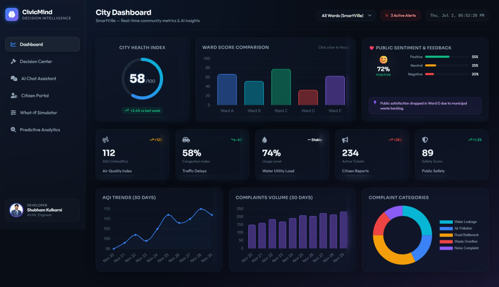
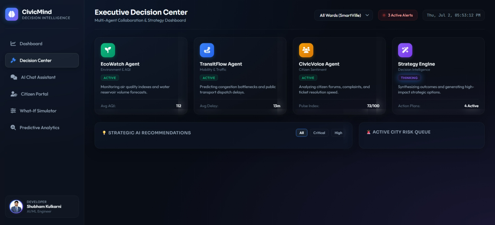
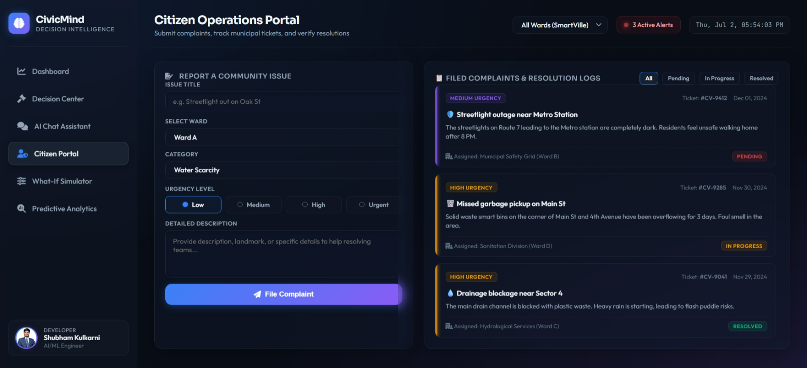
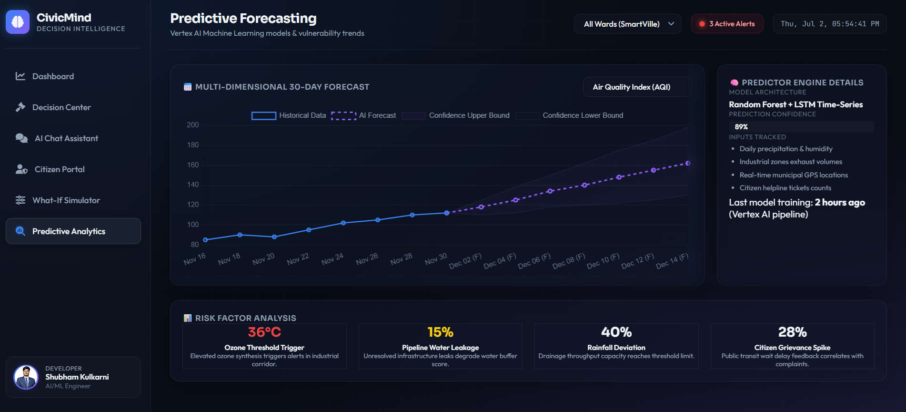
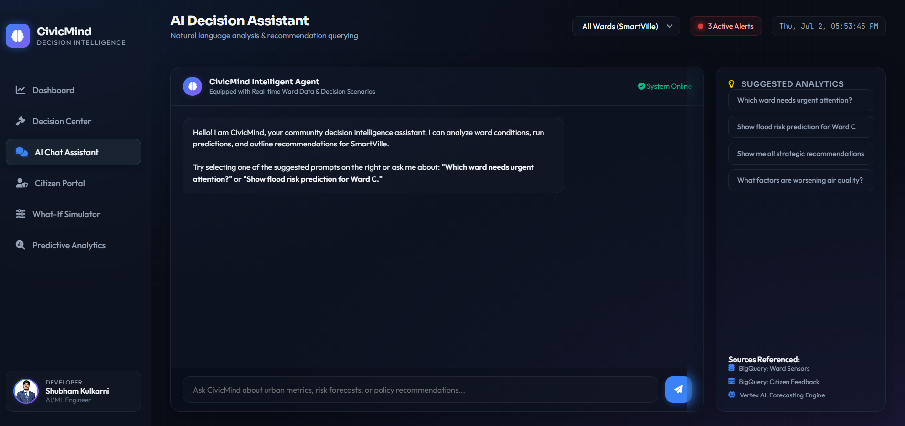

# CivicMind - Community Decision Intelligence Platform

<div align="center">

# 🏙️ CivicMind
## Community Decision Intelligence Platform

**AI-powered platform that helps communities make smarter decisions using real-time data, predictive analytics, and autonomous AI agents**

[](https://cloud.google.com/vertex-ai)
[](https://ai.google.dev/)
[](https://cloud.google.com/bigquery)
[](https://fastapi.tiangolo.com/)
[](https://nextjs.org/)
[](https://opensource.org/licenses/MIT)

</div>


---

## 📸 Interface Preview

Here is a visual overview of the **CivicMind** Glassmorphic platform:

| 📊 City Dashboard | ⚡ Executive Decision Center |
|:---:|:---:|
|  |  |
| *Real-time metrics, comparison trends, and Community Pulse* | *Multi-agent insights, priority risk queue, and action recommendations* |

| 🛡️ Citizen Operations Portal | 🧠 AI Forecasting & Analytics |
|:---:|:---:|
|  |  |
| *Citizen issue filing form and dynamic resolution logging* | *Predictive ML trends, confidence bounds, and impact analysis* |

| 💬 AI Decision Assistant |
|:---:|
|  |
| *Natural language query agent with Vertex AI and RAG integration* |

---

## 🎯 Problem Statement

Communities generate massive amounts of data — citizen complaints, weather, traffic, pollution, water usage, public health — but decision-makers struggle to answer:

- **What** is happening?
- **Why** is it happening?
- **What will** happen next?
- **What should** we do?

**CivicMind** becomes the AI brain for community decision-making.

---

## 🏗️ Architecture

```
Data Sources (Mock/BigQuery)
        ↓
   Analytics Engine
        ↓
   Vertex AI + Gemini
        ↓
   Agent Layer (4 AI Agents)
   ├── 🌿 Environment Agent → AQI, Weather, Flood Risk
   ├── 🚗 Mobility Agent → Traffic, Transit, Congestion  
   ├── 👥 Citizen Agent → Complaints, Sentiment, Satisfaction
   └── 💡 Recommendation Agent → Combines all → Action Plans
        ↓
   Community Dashboard + Command Center + Chat + Simulator
```

---

## 🚀 Features

### 1. Executive Command Center (`/decision-center`)
- **Critical Issues Table** with severity, confidence, and trend indicators
- **Action Items** with Impact vs Cost priority matrix
- **Agent Collaboration Timeline** — watch AI agents detect, analyze, and collaborate in real-time
- **Community Pulse** — sentiment analysis with ward-by-ward breakdown
- **AI Executive Summary** — one-paragraph crisis overview

### 2. Community Dashboard (`/`)
- Real-time metrics: AQI, Traffic, Water Usage, Complaints, Safety, Community Pulse
- Community Health Score (0-100) with animated score drop during crisis
- 5-ward comparison bars with crisis indicators
- 30-day trend charts
- **Explainable AI** — every prediction includes WHY

### 3. AI Chat Assistant (`/chat`)
- "Ask Your Community" natural language interface
- Agent-attributed responses (Environment/Mobility/Citizen/Recommendation)
- Confidence scores on every response
- Explainable AI — every answer includes WHY
- Suggested crisis-related questions

### 4. Predictive Analytics (`/analytics`)
- Flood, Water, Traffic, Waste, Pollution risk predictions
- AQI/Rainfall/Traffic/Sentiment trend charts
- Radar ward comparison
- Time range selector + ward filters

### 5. What-If Simulator (`/simulator`)
- **Digital Twin** — simulate policy changes before implementation
- Before/After community score comparison
- Risk level reduction visualization
- **Explainable AI** — every simulation explains WHY the predicted impact
- Crisis Response Demo scenario
- Custom scenario input

### 6. Community Health Score
- **20%** Environment | **20%** Mobility | **20%** Water | **20%** Safety | **20%** Satisfaction
- Per-ward breakdown with category scores
- AI explains score changes

### 7. Live Community Health Map
- SVG city map with ward-level health visualization
- Color-coded by score (Green/Yellow/Orange/Red)
- Click to drill down into ward details
- Pulsing indicators for crisis wards

### 8. Explainable AI (贯穿所有功能)
- Every prediction answers **WHY**
- Driver analysis with contribution bars
- Confidence intervals
- Methodology transparency
- Agent attribution on all AI outputs

### 9. Community Pulse
- Sentiment analysis from citizen complaints
- Positive/Neutral/Negative breakdown
- Ward-by-ward pulse scores
- AI insight on sentiment drivers

---

## 🛠️ Tech Stack & Architecture Deep-Dive

### 1. Unified Frontend Client Stack
*   **Structure:** Semantic **HTML5** structure optimized for fast rendering and browser search engine indexation.
*   **Styling (Modern Glassmorphic Slate Theme):** Pure **CSS3** design utilizing:
    *   Glassmorphism blur filters (`backdrop-filter: blur(12px)`) with subtle borders (`rgba(255, 255, 255, 0.07)`).
    *   Interactive radio selection capsules and custom ranges/sliders.
    *   Sleek scrollbar modifications to replace chunky default browser layouts.
    *   Responsive layouts using dynamic grids (`display: grid`) and flexboxes.
    *   Color-coded glowing urgency indicators matching ticket levels.
*   **Application Logic:** Modular **ES6 JavaScript** featuring:
    *   Active view controller and client-side page state retention.
    *   Local database fallbacks to support zero-downtime, fully interactive offline demos via `file:///` protocol.
    *   Dynamic DOM rendering and custom HTML escaper layers.
*   **Data Visualization:** **Chart.js v4 (via CDN)** rendering line charts with confidence bounds, multi-dataset ward comparisons, complaint categories doughnuts, and simulator outcomes comparison graphs.
*   **Icons & Assets:** **FontAwesome Icons v6.5** and Google Fonts (**Sora**, **Outfit**, **JetBrains Mono**).

### 2. High-Performance API Backend
*   **Framework:** **FastAPI 0.111.0** (Python 3.10+) serving high-speed JSON responses.
*   **Routing & Controllers:** Segmented routers (Dashboard, Chat, Predict, Recommend, Simulate, Agents, Decision Center).
*   **Static Serving:** Configured via `aiofiles` and `StaticFiles` to serve the unified static UI natively from root `/`, creating a single-port deployment structure.
*   **ASGI Server:** **Uvicorn 0.30.0** handling async request loops and reload triggers.
*   **Validation:** **Pydantic v2** enforcing strict request/response schema boundaries.

### 3. AI Agents & Machine Learning Core
*   **Predictive Modeling:** **Scikit-Learn 1.5.0** & **NumPy** power ML algorithms that forecast flood probability, water scarcity margins, traffic indices, waste overflow limits, and emission metrics.
*   **Data Manipulation:** **Pandas 2.2.2** generating time-series forecast vectors.
*   **Generative AI Orchestration:** **Google Gemini 2.5** (via `google-generativeai` and Vertex AI) powers the:
    *   **Decision Strategy Synthesizer:** Compiles raw ward statistics into actionable policy targets.
    *   **Intelligent Chat Assistant:** Natural language search answering with citations, references, and follow-up suggestion blocks.
*   **Multi-Agent Collaborative Matrix:**
    *   🌿 **EcoWatch Agent:** Assesses environment, air pollution spikes, and weather anomalies.
    *   🚗 **TransitFlow Agent:** Assesses road delays, delays, and scheduling bottle-necks.
    *   👥 **CivicVoice Agent:** Evaluates citizen grievances volume and public sentiment indices.
    *   💡 **Strategy Engine:** Recommendation synthesis compiling individual metrics into critical priority queues.

### 4. Database & Cloud Architecture (Enterprise Grade)
*   **Data Warehouse:** **Google BigQuery** (leveraged for historical logs storage).
*   **Object Storage:** **Google Cloud Storage (GCS)** holding raw unstructured reports.
*   **RAG Engine:** **Vertex AI Vector Search** providing fast context search injections for LLM requests.
*   **Containerization:** **Docker** and **Docker Compose** orchestrating isolated client/server processes.

---

## 📁 Project Structure

```
civicmind/
├── backend/                     # FastAPI Server & App Source
│   ├── main.py                  # Server entrypoint (serves static UI at /)
│   ├── static/                  # ⭐ Unified Frontend static assets
│   │   ├── index.html           # Main markup structure
│   │   ├── styles.css           # Glassmorphic Slate stylesheet
│   │   └── app.js               # Responsive charts & state logic
│   ├── routers/                 # API endpoint routers
│   │   ├── dashboard.py
│   │   ├── chat.py
│   │   ├── predict.py
│   │   ├── recommend.py
│   │   ├── simulate.py
│   │   ├── agents.py
│   │   └── decision_center.py
│   ├── models/                  # Core computations & scoring
│   │   ├── scorer.py
│   │   └── predictor.py
│   ├── agents/                  # Multi-Agent systems
│   │   ├── environment_agent.py
│   │   ├── mobility_agent.py
│   │   ├── citizen_agent.py
│   │   └── recommendation_agent.py
│   └── data/generate_data.py   # Mock data generator
│
├── frontend_demo/               # Demo preview screenshot files
│   ├── dashboard.png
│   ├── desion.png
│   ├── citizen.png
│   ├── forcaste.png
│   └── ai.png
│
├── .github/                     # GitHub community guidelines & issue templates
├── LICENSE                      # MIT License
├── CONTRIBUTING.md              # Contribution rules
├── CODE_OF_CONDUCT.md           # Contributor Covenant CoC
└── docker-compose.yml           # Multi-service container config
```

---

## ⚡ Quick Start

### Method 1: Served Unified Application (Recommended)
1. **Navigate into the backend directory:**
   ```bash
   cd backend
   ```
2. **Install dependencies:**
   ```bash
   pip install -r requirements.txt
   ```
3. **Launch the FastAPI app:**
   ```bash
   python main.py
   ```
4. **Open the live application:**
   Go to `http://127.0.0.1:8000/` to view the fully styled CivicMind dashboard connected to the active API.

### Method 2: Offline Static File Access
1. Simply double-click and open the file [`backend/static/index.html`](file:///d:/SK_docs/projet/cdip/backend/static/index.html) in any browser.
2. The application will run entirely client-side, automatically falling back to the local database to support charts, chat, and simulations offline!

---

## 🎬 Killer Demo Flow (3 Minutes)

**Don't demo features. Demo a crisis.**

1. **Detect** → Dashboard shows score dropping 81→68, crisis alert 🔴
2. **Analyze** → Click Ward D on city map, see compound risk
3. **Predict** → AI explains: "Flood risk HIGH because rainfall +40%, drainage complaints +18%"
4. **Agent Timeline** → Watch 4 agents collaborate in real-time
5. **Recommend** → Decision Center shows 6 immediate actions with Impact/Cost
6. **Simulate** → "Deploy emergency teams" → Score 68→76, Flood Risk 86%→57%
7. **Decide** → Mayor makes data-driven decision with full AI explanation

**Detect → Analyze → Predict → Recommend → Simulate → Decide**

---


## 🔮 Future Scope

- Real-time IoT sensor data integration
- BigQuery streaming inserts
- Vertex AI RAG with community policies
- Cloud Run deployment
- ADK agent deployment
- Looker Studio dashboards
- Mobile app
- Multi-city support
- Video stream analysis for traffic/safety

---

**CivicMind transforms fragmented community data into predictive insights, explainable recommendations, and simulated outcomes, enabling governments and communities to make smarter, faster, and more resilient decisions.**

Built with ❤️ by [Shubham Kulkarni](https://kulkarnishub377.github.io/)
